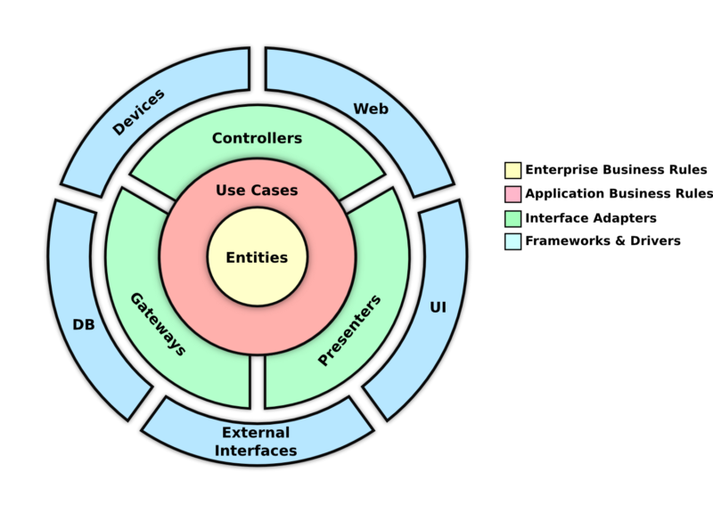

# TS API Template
This is a TS API template


## Getting Started
### 1. Project Dependencies
#### 1.1 Node version
We are using specific node version for this app which is `>=v18`.

Before installing package dependencies, make sure you have [NVM](https://github.com/nvm-sh/nvm) and then run `nvm use`. This will change the node version you are using automatically.
#### 1.2 Docker
Make sure you have docker installed. You can download the [Docker Desktop](https://www.docker.com/products/docker-desktop/) through their website.

### 2. Clone the project
Run `git clone https://github.com/janmallari/ts-api-template`

### 3. Install dependencies
Run `npm install` in the root of the project

### 4. Environment variables
Make sure you have a copy of the environment variables in `.env`

### 5. Running the app
When everything is set-up properly, you can follow the steps below to run the project.

```bash
# Make sure that your docker desktop is running
# and all dependencies has been installed already

# run the containers
npm run up


# if it's the first time running this project
# you need to run the migration and seeder scripts

# migration
npm run db:migrate

# seed
npm run db:seed


# run the API
npm run dev
```

## Project Development
To keep the team works in harmony and ensure that we are pushing good quality codebase, we are trying stick to a specific flow of development.

### Clean Code Architecture



To ensure that the system is easily maintainable, extensible, and, testable, we are utilizing the **Clean Code Architecture**. Read more about the [Clean Code Architecture](https://blog.cleancoder.com/uncle-bob/2012/08/13/the-clean-architecture.html) here.

Basically, the idea here is to isolate all working parts of the codebase. It emphasizes the idea that different parts of the application should have clearly defined responsibilities and should be independent of each other.

The setup is explained in [Project Structure](/docs/Project%20Structure.md).

---

### Git hooks
To make sure that we are pushing clean, error-free, and test codebase, `git hooks` are placed in.

#### Git commit messages
It is **IMPORTANT** *(and good practice)* to make sure that your commit message follow this convention: [Git Conventional Commits](https://www.conventionalcommits.org/en/v1.0.0/). If you missed out the commit message, the terminal will show some suggestions.

#### pre-commit
- `prettify`
  - This is added to prettify the codebase based on the prettier config we provided in `.prettierrc.json`. This is to ensure that this project follows a very strict coding style.
- `test`
  - This runs all test cases to ensure that there are no failing tests before actually committing the code

---

### CI/CD
This project has CI/CD setup. There are different pipelines for each git branch pushed to the repo.

1. `develop`
    - When a code is merged to the `develop` - be it via PR or pushed from local branch, the pipeline will run the test cases. This is to ensure that the codes push to the repo are tested.
2. `staging` or `production`
    - When a code is merged to `staging`. The pipeline will do the following steps
      - It will run the test cases
      - Build a new docker image
      - Push the latest docker image to AWS ECR
      - The pipeline will update the Elastic Container Service `services` and `tasks` to use the newly built and deployed docker image
      - The ECS service will then update the running image in EC2 server to use latest docker image